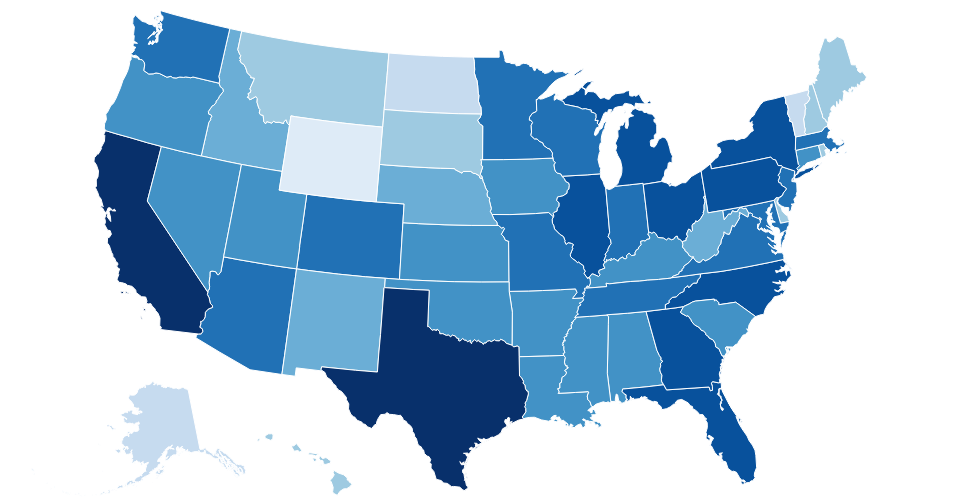

## Choropleth Map of US States :earth_americas:

Choropleth of US States via data and defined color scale 



## Install
```bash
$ npm install @d3-node/choropleth-us-states --save
```

## Usage

```js
const d3nMap = require('@d3-node/choropleth-us-states')

// read CSV -> parse to json
const csv = fs.readFileSync('./StatePopulations.csv').toString()
const data = d3nMap.csvParse(csv)

const stateNameField = 'State' // optional, default = 1st column
const metricField = 'Population' // optional, default = 2nd column
const colors = [
  'rgb(255,245,240)', 'rgb(254,224,210)', 'rgb(252,187,161)',
  'rgb(252,146,114)', 'rgb(251,106,74)', 'rgb(239,59,44)',
  'rgb(203,24,29)', 'rgb(165,15,21)', 'rgb(103,0,13)'
]
const scale = [ // color buckets for state populations
  0, 600000, 800000, 1500000, 2500000, 5000000, 9000000, 20000000, 400000000
]

const map = d3nMap({ data, colors, scale, stateNameField, metricField })
map.svgString() // returns <svg>
```

See [test](./test/index.js) for actual usage.

##### Output the test map to an image (PNG)
```
npm test
```

## API

#### Options 
`{ data, colors, scale, [ stateNameField, metricField ] }`
